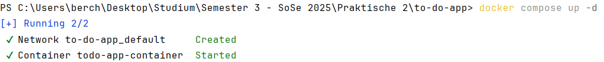
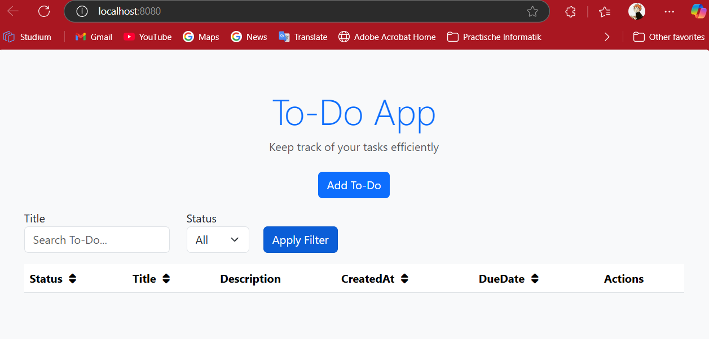
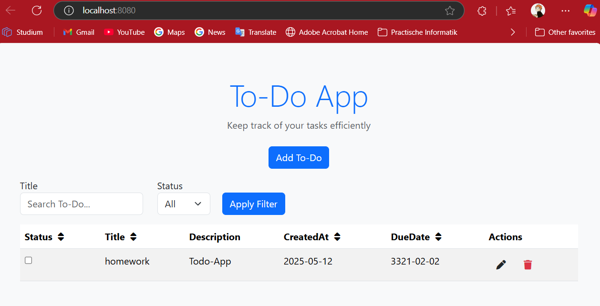
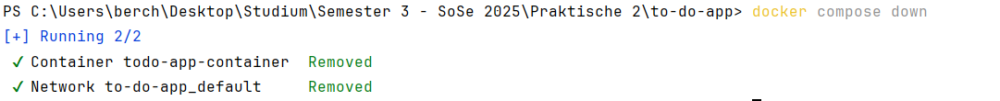

## 📄 Dokumentation zur Containerisierung der To-Do-App (INF1006)

### 🔀 Branch: `HUE1`

### 🧑‍💻 Bearbeiter: *Markus Berchtenbreiter und Ivan Dobrodeev*

---

### ✅ Aufgabe 1: Installation von Docker

* Docker Desktop wurde erfolgreich auf dem lokalen System installiert.
* Die Einführung in Docker Desktop wurde abgeschlossen:

  * Der Container `docker/welcome-to-docker` wurde mit folgendem Befehl gestartet:

    ```bash
    docker run -d -p 8080:80 docker/welcome-to-docker
    ```
  * Die Webseite war unter `http://localhost:8080` erreichbar.
* Ergebnis: Die grundlegenden Docker-Funktionen wurden verstanden und getestet.

---

### 🔧 Aufgabe 2.1: Erstellung des Dockerfiles

#### 🔹 Ausgangspunkt

Die Anwendung besteht aus zwei Teilprojekten:

* `client_app`
* `server_api`

Ein zentrales `package.json`-File auf Root-Ebene dient der gemeinsamen Verwaltung der Build-Schritte.

#### 📄 Ursprünglicher Inhalt des Dockerfiles

```Dockerfile
# syntax=docker/dockerfile:1
FROM node:20-alpine

WORKDIR /app

COPY package*.json ./

RUN npm install --omit=dev

COPY ../../../.. .

ENV HOST=0.0.0.0

CMD [ "npm", "start" ]
```

#### ⚠️ Fehler beim Build-Vorgang

Beim Ausführen von:

```bash
docker build -t todo-app . --progress=plain
```

trat folgender Fehler auf:

```
ERROR: failed to solve: process "/bin/sh -c npm install --omit=dev" did not complete successfully: exit code: 1
```

**Analyse:**
Der Fehler entstand, weil sich im Projektverzeichnis mehrere `package.json`-Dateien befinden (in `client_app`, `server_api` und im Root). Die Anweisung `COPY package*.json ./` kopiert nur die Root-Dateien, ignoriert jedoch die Abhängigkeiten der Submodule. Beim anschließenden `npm install --omit=dev` schlägt die Installation daher fehl.

Zusätzlicher Test zeigte: Der Befehl `ls node_modules` im laufenden Container gab zurück:

```
ls: node_modules: No such file or directory
```

Der Inhalt der Root-`package.json` lautet:

```json
{
  "name": "todo-app",
  "private": true,
  "scripts": {
    "install": "npm ci --prefix client_app && npm ci --prefix server_api",
    "build": "npm run build --prefix client_app && npm run build --prefix server_api",
    "start": "npm run start --prefix server_api"
  }
}
```

Dies zeigt, dass die eigentlichen Abhängigkeiten sich in den Unterordnern befinden. `npm install` im Root-Verzeichnis reicht daher nicht aus.

---

### 💪 Lösung: Aktualisiertes Dockerfile mit Kommentaren

```Dockerfile
# Basis-Image
FROM node:20-alpine

# Arbeitsverzeichnis setzen
WORKDIR /app

# TypeScript-Compiler global installieren
RUN npm install -g typescript

# package.json-Dateien kopieren
COPY client_app/package*.json client_app/
COPY server_api/package*.json server_api/

# Nur Produktionsabhängigkeiten installieren
RUN npm install --omit=dev --prefix client_app \
 && npm install --omit=dev --prefix server_api

# Restliche Dateien kopieren
COPY ../../../.. .

# Backend kompilieren
RUN npx tsc --build server_api/tsconfig.json

# Umgebungsvariable HOST setzen
ENV HOST=0.0.0.0

# Port für außen freigeben
EXPOSE 8080

# Server starten
CMD ["node", "server_api/build/start.js"]


```

---

### ⚠️ Fehler: Image nicht gefunden beim Ausführen des Containers

Nach dem Ausführen des Befehls:

```bash
docker run --rm -p 8080:8080 --name todo-app-container todo-app
```

erscheint folgende Fehlermeldung:

```
Unable to find image 'todo-app:latest' locally
docker: Error response from daemon: pull access denied for todo-app, repository does not exist or may require 'docker login'
```

**Ursache:**
Das Image `todo-app` wurde noch nicht lokal gebaut. Docker versucht es aus Docker Hub zu laden, wo es nicht vorhanden ist.

**Lösung:**

1. Zuerst das Image lokal bauen:

   ```bash
   docker build -t todo-app .
   ```
2. Danach Container starten:

   ```bash
   docker run --rm -p 8080:8080 --name todo-app-container todo-app
   ```

Mit `docker images` kann geprüft werden, ob das Image vorhanden ist.

---

### ⚠️ Fehler beim Öffnen der Anwendung im Browser

Nach dem Starten des Containers mit:

```bash
docker run --rm -p 8080:8080 --name todo-app-container todo-app
```

wurde versucht, die App über folgende URL aufzurufen:

```
http://0.0.0.0:8080
```

Dies führte zu einer Fehlermeldung:

> *"It looks like the webpage at [http://0.0.0.0:8080/](http://0.0.0.0:8080/) might be having issues..."*

**Ursache:**
`0.0.0.0` ist die Adresse, auf der der Container *lauscht* (d. h. von überall erreichbar ist), aber **nicht** die Adresse, die im Browser verwendet werden kann.

**Lösung:**
Verwenden Sie im Browser stattdessen:

```
http://localhost:8080
```

---

### ⚠️ Hinweis zur Terminal-Nutzung beim Containerlauf

Nach dem Ausführen des Befehls:

```bash
docker run --rm -p 8080:8080 --name todo-app-container todo-app
```

konnte das Terminal nicht mehr weiterverwendet werden.

**Ursache:**
Der Befehl startet den Container im Vordergrundmodus (foreground), wodurch das Terminal gebunden bleibt.

**Lösung:**
Füge die Option `-d` hinzu, um den Container im Hintergrund laufen zu lassen:

```bash
docker run -d -p 8080:8080 --name todo-app-container todo-app
```

Damit bleibt das Terminal frei für weitere Eingaben.

---

### 📂 Überprüfung der installierten Abhängigkeiten im Container

Nach dem Starten des Containers mit:

```bash
docker exec -it todo-app-container sh
```

wurde überprüft, ob die Abhängigkeiten korrekt installiert wurden.

#### 📚 client\_app

```bash
/app/client_app # npm ls --depth=0
```

Ausgabe:

```bash
todo-client-app@ /app/client_app
+-- @fortawesome/fontawesome-free@6.7.2
+-- @types/bootstrap@5.2.10
+-- bootstrap@5.3.3
+-- shx@0.4.0
`-- typescript@5.8.3
```

**Analyse:** Alle notwendigen Bibliotheken für eine moderne TypeScript-Clientanwendung mit Bootstrap und Icons sind korrekt vorhanden.

#### 📚 server\_api

```bash
/app/server_api # npm ls --depth=0
```

Ausgabe:

```bash
todo-server-api@ /app/server_api
+-- @types/cors@2.8.17
+-- @types/express@5.0.0
+-- @types/lowdb@1.0.15
+-- @types/node@22.14.0
+-- @types/uuid@10.0.0
+-- cors@2.8.5
+-- express@4.21.2
+-- lowdb@7.0.1
+-- shx@0.4.0
+-- typescript@5.8.3
`-- uuid@11.1.0
```

**Analyse:** Alle Kernkomponenten für eine Express-basierte TypeScript-API sind korrekt installiert, inklusive Typdefinitionen.

---

* Anwendung läuft wie erwartet auf port http://localhost:8080


* Eintrag wurde hinzufügt.


---

### 🔧 Aufgabe 2.3: Erstellen einer Compose-Datei

#### 📄 Grundlegende Compose-Datei Struktur
Wir beginnen mit einer grundlegenden Compose-Datei, die folgendes definiert:
1. Die Version der Compose-Datei (3.8)
2. Einen Service namens `todo-app`
3. Konfiguration zur Verwendung unseres `todo-app` Images
4. Anweisung zum Bauen aus dem aktuellen Verzeichnis

#### 📄  Inhalt des Docker-composefiles

```yaml
version: '3.8'

services:
  todo-app:
    image: todo-app
    build: ../../../..
```

#### 📄 Port-Weiterleitung einrichten

Damit die Anwendung im Browser erreichbar ist, muss der Container-Port (8080) aud den Host-Port (8080) gemappt werden.

#### 📄 Änderungen in der `docker-compose.yml`

```yaml
ports:
  - "8080:8080"  # Host:Container
```

#### ⚠️ Hinweis zur verwendeten Befehle

```bash
docker compose up       # Startet den Container
docker compose down    # Stoppt den Container (falls nötig)
```

---

### Verwendung eines Volumes

#### ⚠️ Ursprüngliches Problem und Lösung

##### Fehlermedung: ```EISDIR: Illegal operation on a directory, read```

* Problem:
  * Die Anwendung versuchte, auf eine Datenbankdatei (todos.json oder db.json) zuzugreifen, fand aber stattdessen ein Verzeichnis.
  * Dies passierte, weil der in DB_FILE_PATH angegebene Pfad nicht korrekt war oder die Datei nicht gefunden wurde.

* Lösung:
  * Korrekte Angabe des Dateipfads in der ```docker-compose.yml```:
  ```yaml
  environment:
  - DB_FILE_PATH=/app/server_api/data/db.json
  ```
  * Docker Volume wurde korrekt gemountet, um die Datenbankdatei persistent zu speichern.

##### Finale ```docker-compose.yml``` mit Erklärungen

```yaml
services:
  todo-app:
    build: .
    image: todo-app
    container_name: todo-app-container
    ports:
      - "8080:8080"
    environment:
      - HOST=0.0.0.0
      - DB_FILE_PATH=/app/server_api/data/db.json
    volumes:
      - todo-data:/app/server_api/data

volumes:
  todo-data:
```

##### Schlüsselkomponenten erklärt:

| Einstellung|	Beschreibung|
|--------|-------------|
|build: .|	Nutzt das Dockerfile im Projektverzeichnis.|
|ports: "8080:8080"|	Leitet Port 8080 des Containers auf Port 8080 des Hosts weiter.|
|DB_FILE_PATH|	Definiert den Pfad zur Datenbankdatei im Container.|
|volumes: todo-data:/app/...|	Stellt sicher, dass die Datenbankdatei persistent gespeichert wird.|

### Testing des Volumes
#### Durchführung von ```docker compose up```:



#### Nach Durchführung von ```docker compose up```:



#### Erstellen eines Einträges



#### Durchführung von ```docker compose down```:



#### Finales Ergebnis


* Da der Eintrag persistenz gespeichert wurde, ist er nach dem Neustart der Anwendung geblieben
