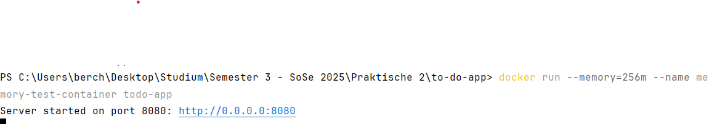
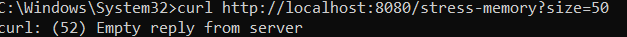
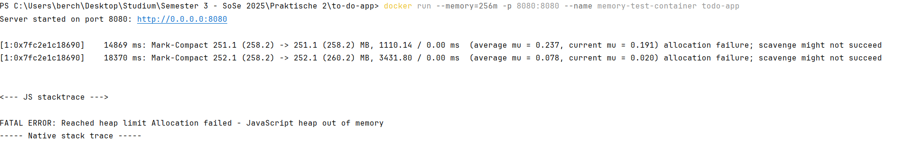
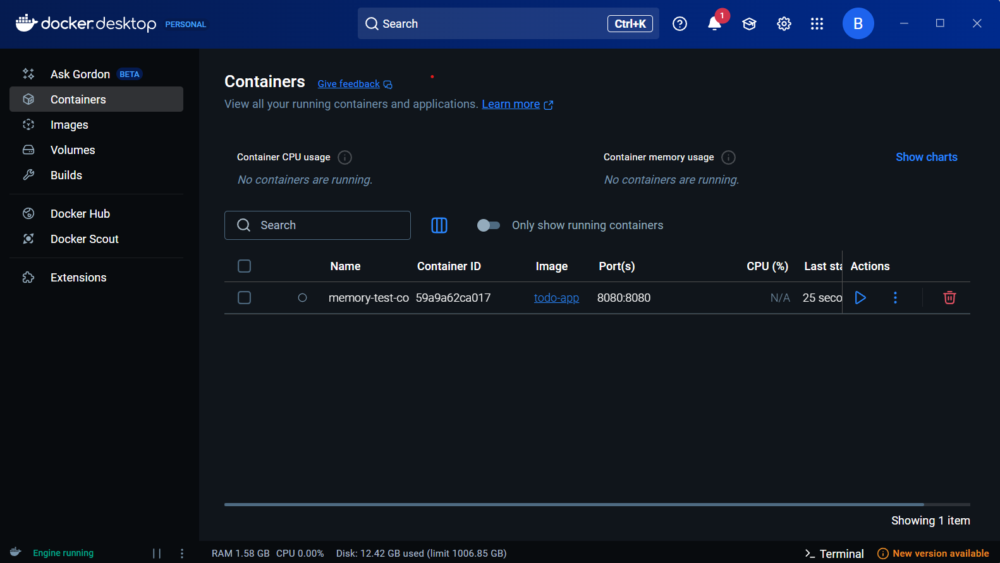

# 📄 Dokumentation zur Speicherüberlauf im Container

## 🔀 Branch: `HUE1`

## 🧑‍💻 Bearbeiter: *Markus Berchtenbreiter und Ivan Dobrodeev*


### 📌 Ziel

In dieser Aufgabe wurde eine neue Route `/stress-memory` zur To-Do-Anwendung hinzugefügt, die bewusst Speicher allokiert, um die Speicherauslastung des Servers zu simulieren. Ziel war es, das Verhalten eines Containers unter Speicherbeschränkungen zu beobachten.

---

### 🛠️ Umsetzung

#### Neue Route zur Speicherauslastung

In der Datei `todo-server.ts` wurde folgende Route ergänzt:
```ts
const memoryHog: Buffer[] = [];

app.get('/stress-memory', (req: Request, res: Response) => {
  const size = parseInt(req.query.size as string || '10'); // Größe in MB
  if (isNaN(size) || size <= 0) {
    return res.status(400).send('Ungültige Größe');
  }

  const allocatedMemory = Buffer.alloc(size * 1024 * 1024, 'a'); // Allokiert "size" MB im RAM
  memoryHog.push(allocatedMemory); // Speichert die allokierten Daten in einem Array, damit sie nicht vom Garbage Collector gelöscht werden

  res.send(`Allocated additional ${size} MB. Total chunks: ${memoryHog.length}`);
});
```

#### Erklärung des Codes

| **Codezeile** | **Erklärung** |
|---------------|----------------|
| `req.query.size` | Liest den Wert des URL-Parameters `size` aus (z. B. `/stress-memory?size=50`) |
| `parseInt(...)` | Wandelt den Parameter von String in eine Zahl (Integer) um |
| `if (isNaN(size) || size <= 0)` | Überprüft, ob der Parameter gültig ist (z. B. kein Text oder negative Zahl) |
| `Buffer.alloc(...)` | Allokiert Speicher im RAM – hier wird ein **Buffer** mit `size` Megabytes erzeugt |
| `size * 1024 * 1024` | Umrechnung von MB in Byte (1 MB = 1024 × 1024 Byte) |
| `'a'` | Der Buffer wird mit dem Zeichen `'a'` gefüllt – einfach nur, um die Speicherbelegung zu initialisieren |
| `memoryHog.push(...)` | Speichert den Buffer in einem globalen Array, damit er **nicht** vom Garbage Collector gelöscht wird |
| `res.send(...)` | Sendet eine Bestätigung zurück mit der Anzahl der allokierten Chunks |

### 🐳 2. Container mit Speichergrenze starten

```bash
docker run --memory=256m -p 8080:8080 --name memory-test-container todo-app
```


### ⚙️ 3. Aufruf der Route zum Auslösen von Speicherverbrauch

```bash
curl http://localhost:8080/stress-memory?size=50
```


Das bedeutet:

🛑 Der Server hat die Verbindung akzeptiert, aber keine gültige HTTP-Antwort zurückgesendet.

Das passiert in der Regel, wenn dein Server abgestürzt ist oder sich unerwartet beendet hat – und genau das ist in deinem Fall zu erwarten, wenn du die Route /stress-memory testest.

Denn: Diese Route versucht, Speicher zu allokieren, bis das im Container gesetzte Limit (z. B. 256 MB) erreicht wird. Sobald Node.js keinen weiteren Speicher mehr zuweisen kann, bricht der Server mit einem „Out of Memory“-Fehler ab – er stürzt ab, ohne eine Antwort an den Client (also curl) zurückzugeben.

### 🔍 4. Beobachtungen

#### Verhalten bei Speicherüberschreitung

Beim mehrfachen Aufruf der Route `/stress-memory` stieg die Speicherauslastung, bis der Container einen **Speicherüberlauf** verursachte. Danach trat folgender Fehler auf:

```
FATAL ERROR: Reached heap limit Allocation failed - JavaScript heap out of memory
```


#### Container-Verhalten

Der Node.js-Prozess wurde durch den Container gestoppt. Der Container beendet sich, sobald die Speichergrenze überschritten wird.



### 🧠 Bedeutung von `--memory-swap`

- Die Option `--memory-swap` kontrolliert, wie viel **zusätzlicher Swap-Speicher** ein Container verwenden darf.
- Wenn z. B. `--memory=256m` und `--memory-swap=512m` gesetzt ist, darf der Container insgesamt 512 MB nutzen (RAM + Swap).
- Ohne Angabe von `--memory-swap` ist standardmäßig keine Nutzung von Swap erlaubt.

### ✅ Fazit
- Die gezielte Speicherallokation zeigt anschaulich, wie Docker-Container auf Speichergrenzen reagieren:

- Der Node.js-Prozess stürzt bei zu hoher Speichernutzung ab.

- Der Container bleibt im „Exited“-Status.

- Speichergrenzen und Swap-Verhalten lassen sich mit Docker-Parametern exakt kontrollieren.
