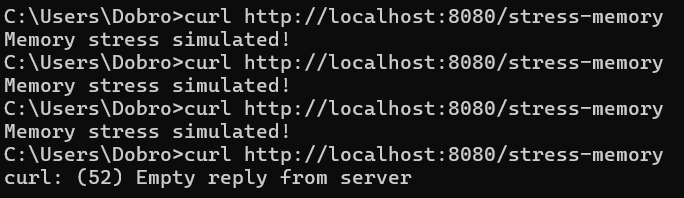

# 📄 Dokumentation zur Speicherüberlauf im Container

## 🔀 Branch: `HUE1`

## 🧑‍💻 Bearbeiter: *Markus Berchtenbreiter und Ivan Dobrodeev*


### 📌 Ziel

In dieser Aufgabe wurde eine neue Route `/stress-memory` zur To-Do-Anwendung hinzugefügt, die bewusst Speicher allokiert, um die Speicherauslastung des Servers zu simulieren. Ziel war es, das Verhalten eines Containers unter Speicherbeschränkungen zu beobachten.

---

### 🛠️ Umsetzung

#### Neue Route zur Speicherauslastung

In der Datei `todo-server.ts` wurde folgende Route ergänzt:
```ts
const memoryHog: any[] = [];
app.get('/stress-memory', (req, res) => {
  for (let i = 0; i < 10000; i++) {
    memoryHog.push(new Array(1000).fill('*'));
  }
  res.send('Memory stress simulated!');
});

```

#### Erklärung des Codes

| **Codezeile**                           | **Erklärung**                                                                                                                  |
|-----------------------------------------|--------------------------------------------------------------------------------------------------------------------------------|
| `const memoryHog: any[] = [];`          | Erstellt ein leeres Array, in dem große Datenmengen gespeichert werden, um den RAM zu belasten. Existenz von diese Konstant verhindert, dass der Garbage Collector ihn löscht |
| `app.get('/stress-memory', ...)`        | Definiert eine neue GET-Route unter `/stress-memory`, die absichtlich viel Speicher beansprucht                                |
| `for (let i = 0; i < 1000000; i++)`     | Schleife läuft **eine Million Mal**, um eine große Menge an Speicher zu belegen                                                |
| `new Array(1000).fill('*')`             | Erzeugt ein neues Array mit 1000 Elementen, die alle mit dem Zeichen `'*'` gefüllt sind                                        |
| `memoryHog.push(...)`                   | Fügt das erzeugte Array in `memoryHog` ein|
| `res.send('Memory stress simulated!')`  | Sendet nach dem Durchlauf der Schleife eine Antwort an den Client, dass der Test abgeschlossen ist                             |


### 🐳 2. Container mit Speichergrenze starten

```bash
docker run --memory=256m -p 8080:8080 --name memory-test-container todo-app
```


### ⚙️ 3. Aufruf der Route zum Auslösen von Speicherverbrauch

```bash
curl http://localhost:8080/stress-memory
```


Mehrfaches Ausführen dieses Befehls erhöht die Speicherauslastung.

### 🔍 4. Beobachtungen

#### Verhalten bei Speicherüberschreitung

Beim mehrfachen Aufruf der Route `/stress-memory` stieg die Speicherauslastung, bis der Container einen **Speicherüberlauf** verursachte. Danach trat folgender Fehler auf:

```
FATAL ERROR: Reached heap limit Allocation failed - JavaScript heap out of memory
```


#### Container-Verhalten

Der Node.js-Prozess wurde durch den Container gestoppt. Der Container beendet sich, sobald die Speichergrenze überschritten wird.


### 🧠 Bedeutung von `--memory-swap`

- Die Option `--memory-swap` kontrolliert, wie viel **zusätzlicher Swap-Speicher** ein Container verwenden darf.
- Wenn z.B. `--memory=256m` und `--memory-swap=512m` gesetzt ist, darf der Container insgesamt 512 MB nutzen (RAM + Swap).
- Ohne Angabe von `--memory-swap` ist standardmäßig keine Nutzung von Swap erlaubt.

### ✅ Fazit
- Die gezielte Speicherallokation zeigt anschaulich, wie Docker-Container auf Speichergrenzen reagieren:

- Der Node.js-Prozess stürzt bei zu hoher Speichernutzung ab.

- Der Container bleibt im „Exited“-Status.

- Speichergrenzen und Swap-Verhalten lassen sich mit Docker-Parametern exakt kontrollieren.
