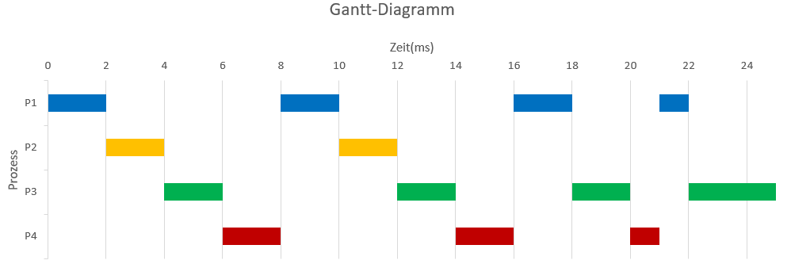

# 📄 Dokumentation zur Round-Robin Scheduling Algorithm

## 🧑‍💻 Bearbeiter: *Markus Berchtenbreiter und Ivan Dobrodeev*

---

## Round-Robin Scheduling Algorithm

### Aufgabenbeschreibung
Diese Aufgabe demonstriert den Round-Robin-Scheduling-Algorithmus mit den folgenden Prozessen und einem Zeitfenster (Time-Slice) von 2 ms:

| Process | 	Ankunftszeit (ms) | Ausführungszeit (ms) |
|---------|--------------------|---------------------|
| P1      | 0                 | 7                   |
| P2      | 2                 | 4                   |
| P3      | 4                 | 9                   |
| P4      | 6                 | 5                   |

---

### Gantt Chart
Das folgende Gantt-Diagramm zeigt die Ausführung der Prozesse über die Zeit:

---

### Calculations

#### Endzeiten:
- **P1:** 22 ms
- **P2:** 12 ms
- **P3:** 25 ms
- **P4:** 21 ms

#### Turnaround Time(Durchlaufzeit) = Endzeit – Ankunftszeit:
- **P1:** 22 - 0 = 22 ms
- **P2:** 12 - 2 = 10 ms
- **P3:** 25 - 4 = 21 ms
- **P4:** 21 - 6 = 15 ms

Durchschnittliche Wartezeit: (22+10+21+15)/4 = 17.5 ms

#### Waiting Time(Wartezeit) = Turnaround - Ausführungszeit:
- **P1:** 22 - 7 = 15 ms
- **P2:** 10 - 4 = 6 ms
- **P3:** 21 - 9 = 12 ms
- **P4:** 15 - 5 = 10 ms

Durchschnittliche Wartezeit: (15+6+12+10)/4 = 10.75 ms

---

### Erklärung des Round-Robin-Scheduling
Der Round-Robin-Scheduling-Algorithmus ist ein präemptives Verfahren, bei dem jeder Prozess eine feste Zeitscheibe (Time-Slice) erhält. Wenn ein Prozess in dieser Zeit nicht fertig wird, wird er ans Ende der Warteschlange verschoben, und der nächste Prozess wird ausgeführt.

#### Vorteile
- Fairness: Alle Prozesse erhalten gleich viel CPU-Zeit.
- Geringere Wartezeit für kurze Prozesse.
- Geeignet für zeitkritische Anwendungen.

#### Nachteile
- Hoher Overhead durch häufiges Umschalten (Context Switching).
- Ineffizient, wenn die Zeitscheibe zu klein oder zu groß ist.

---
